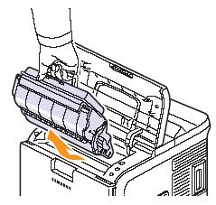
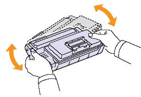
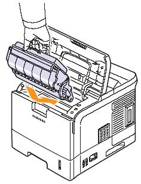

Как равномерно распределить тонер (ML-4550, ML-4551N, ML- 4551ND)
=================================================================

Как равномерно распределить тонер

[Обзор]

Когда тонер заканчивается:

    На печати появляются блёклые участки.
    На дисплее появляется соответствующее сообщение
    Светодиоды загораются красным.

Временно эту проблему можно решить, распределив равномерно тонер внутри картриджа.

[Метод решения]

1) Откройте верхнюю крышку.
2) Вытащите картридж.

Внимание

    Область фьюзера очень горячая, будьте внимательны, чтобы не обжечься.
    Не оставляйте картридж на свету больше, чем на несколько минут.
    Не прикасайтесь руками либо иными предметами к зеленой (или небесно-голубой) поверхности и барабану OPC. Пользуйтесь ручкой на каждом картридже, чтобы не допустить прикосновения к указанной поверхности.

3) Хорошенько встряхните 5-6 раз картридж, чтобы равномерно распределить тонер.

4) Определите расположение пазов для картриджа в принтере. Взяв картридж за рукоять, совместите с пазами и аккуратно вставьте назад в принтер до щелчка.

5) Плотно закройте верхнюю крышку. Если крышка будет закрыта плохо, принтер не будет работать.
