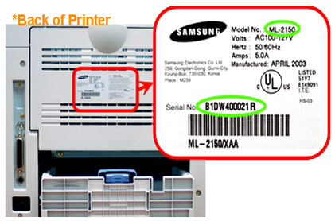

Печать отчета о конфигурации сети
=================================

Печать отчета о конфигурации сети Печать Отчета о конфигурации сети можно запустить с панели управления устройства, где отображены текущие сетевые параметры устройства. Этот отчет поможет вам в настройке сети. Если устройство не оснащено дисплеем: Нажмите на кнопку 
 

(Отмена или Стоп/Сброс) на панели управления и удерживайте две секунды. В данном Отчете о конфигурации сети можно найти MAC-адрес и IP-адрес устройства. Пример: MAC-адрес: 00:15:99:41:A2:78 IP-адрес: 165.254.192.192 
