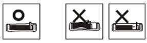

Какие есть секреты, чтобы не допустить замятия бумаги
======================================================

[Метод решения] 

При выборе средств и материалов соответствующего типа, замятия бумаги можно избежать. Если произошло замятие бумаги, обратитесь к следующему руководству. 
Убедитесь, что регулируемые направляющие установлены правильно. 
Не перегружайте лоток. Убедитесь, что уровень бумаги ниже отметки максимального уровня на внутренней стороне лотка. 
Не убирайте бумагу из лотка в процессе печати принтера. 
Согните, раздуйте и выровняйте бумагу перед загрузкой. 
Не используйте смятую, влажную, или туго свернутую бумагу. 
Не смешивайте в лотке бумагу разных типов. 
Используйте только рекомендованные материалы для принтера. 
Убедитесь, что бумага лежит в лотке рекомендованной стороной вверх (или вниз в многоцелевом лотке). 
Если замятия бумаги происходят часто, когда вы печатаете на бумаге формата A5/B5: Загрузите бумагу в лоток так, чтобы большая сторона лежала вдоль переднего края лотка. 

 
Направляющие лотка установлены на формат письма (Letter) или формат A4, в зависимости от страны покупателя. Чтобы изменить формат, вам необходимо отрегулировать направляющие бумаги. 

1. Откиньте заднюю стенку лотка наружу, чтобы увеличить длину лотка. 

2. Скользящим движением переместите направляющую бумаги, чтобы установить ее в положение, соответствующее формату бумаги, которую вы загружаете. Маркировка формата нанесена на дно лотка. 

.. tip::  (1) Боковая направляющая бумаги 

3. Согните или раздуйте край бумажной пачки, чтобы разделить листы бумаги перед ее загрузкой. 

4. После укладывания бумаги в лоток передвиньте боковые направляющие бумаги в положение требуемого формата, который отмечен на дне лотка. 

.. warning:: Не продвигайте боковую направляющую слишком далеко в лоток, это может привести к замятию бумаги. 

end